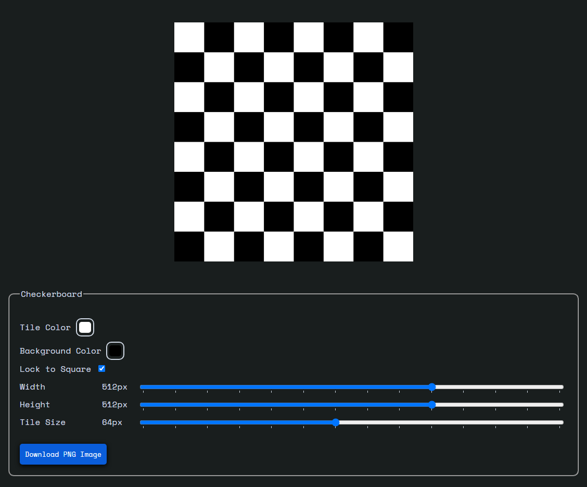

# Checkerboard
A very simple tool to create checkerboards properly scaled to 2^n for graphics programming and UV editing.
[https://checkerboard.pages.dev/](https://checkerboard.pages.dev/)

## Contributing & Liscense
If you want another feature feel free to add it and submit a PR. I will probabaly be less likely to accept style overhauls and related changes. All code is liscensed under MIT. Feel free to use for whatever!